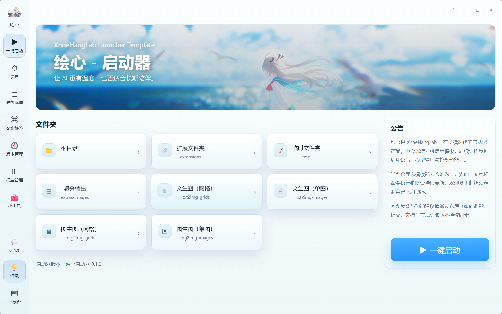
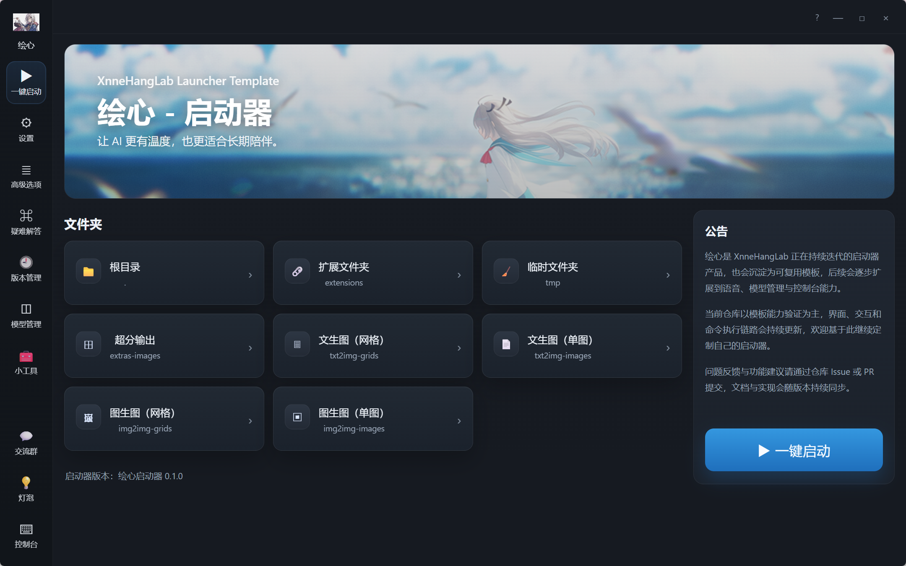

<p align="center">
  <a href="https://xnnehang.top/">
    
  </a>
</p>

<h1 align="center">绘心 Launcher Template</h1>

<p align="center">
  基于 <a href="https://github.com/XnneHangLab/XnneHangLab">XnneHangLab</a> 的桌面启动器模板仓库
</p>

<p align="center">
  
  
  
  
  
</p>

---

> [!NOTE]
> 这个仓库不是一次性的页面 Demo。
>
> 它的目标是沉淀一个可复用、可扩展、可打包成 exe 的桌面启动器模板，
> 用于承载后续的语音、角色、陪伴型 AI 产品。

> [!TIP]
> 当前品牌方向为「绘心」。
>
> 当前 UI 风格参考绘世启动器，但仓库本身保持模板属性，后续可以继续演化为具体产品。

## 项目定位

绘心 Launcher Template 是一个桌面启动器模板仓库，主要解决这几类问题：

- 桌面端统一入口怎么做
- 启动器 UI 怎么组织得更像产品
- 环境检查、资源下载、启动管理怎么抽象
- 如何把 HTML 原型演进成长期可维护的桌面工程

## 当前特性

- 基于 Tauri 2 + React 18 + Vite 5 + TypeScript
- 桌面启动器布局已成型
- 已具备侧边栏导航、首页、设置页等基础结构
- 已接入窗口控制相关前端逻辑
- 适合继续扩展为完整 Launcher

## 为什么单独做这个仓库

> [!IMPORTANT]
> 主仓库更偏完整系统。
>
> 而这个仓库更偏“桌面壳层模板”，目标不同：
>
> - 更轻
> - 更适合分发
> - 更适合做产品化桌面入口
> - 更适合复用到多个子项目

## 预览

| 日间界面 | 夜间界面 |
| :--: | :--: |
|  |  |

## 适用场景

- TTS / STT / AI 陪伴类产品启动器
- 模型管理与下载入口
- 资源检查与环境检查界面
- 本地整合包桌面壳
- 可继续复用的桌面 UI 模板

## 技术栈

```text
Tauri 2
React 18
Vite 5
TypeScript
Vitest + React Testing Library
```

## 开发运行

安装依赖：

```bash
npm install
```

前端开发：

```bash
npm run dev
```

桌面开发：

```bash
npm run tauri dev
```

测试：

```bash
npm run test -- --run
```

构建：

```bash
npm run build
```

Rust 检查：

```bash
cargo check --manifest-path src-tauri/Cargo.toml
```

## 项目结构

```text
.
├── src/                         # 前端源码
│   ├── components/              # React 组件
│   │   └── ui/                  # shadcn/ui 组件
│   ├── i18n/                    # 国际化
│   │   ├── index.ts             # i18n 配置入口
│   │   └── locales/             # 多语言文案文件
│   ├── lib/                     # 通用工具函数
│   ├── pages/                   # 页面组件
│   │   ├── home.tsx             # 主窗口页面
│   │   ├── about.tsx            # 关于页面
│   │   └── settings.tsx         # 设置页面
│   └── main.tsx                 # 前端入口与基于 pathname 的页面选择器
├── src-tauri/                   # Tauri / Rust 后端
│   ├── src/                     # Rust 源码
│   └── tauri.conf.json          # Tauri 配置
├── docs/                        # 文档目录
│   ├── AUTO_UPDATE.md           # 自动更新说明
│   ├── I18N.md                  # 国际化说明
│   └── GLOBAL_SHORTCUT.md       # 全局快捷键说明
├── components.json              # shadcn/ui 配置
└── package.json                 # 前端依赖与脚本
```
